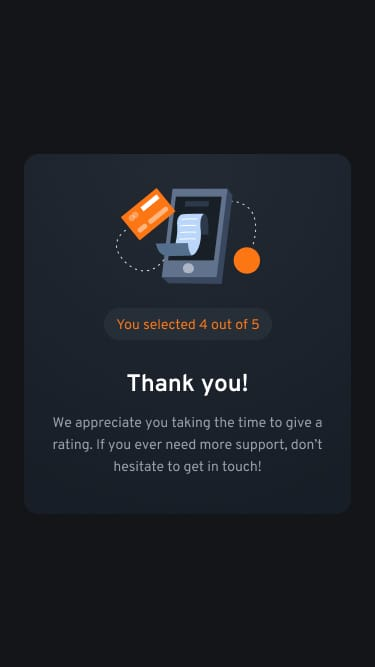

# Interactive Rating Component

A clean and responsive rating interface that lets users select feedback from 1-5 and see a personalized thank you message. Built with semantic HTML, CSS custom properties, and vanilla TypeScript.

## Table of contents

- [Overview](#overview)
  - [The challenge](#the-challenge)
  - [Screenshot](#screenshot)
  - [Links](#links)
- [My process](#my-process)
  - [Built with](#built-with)
  - [What I learned](#what-i-learned)
  - [Continued development](#continued-development)
- [Author](#author)


## Overview

### The challenge

Users should be able to:

- View the optimal layout for the app depending on their device's screen size
- See hover and active states for all interactive elements on the page
- Select and submit a number rating from 1 to 5
- See the "Thank you" card state after submitting a rating

### Screenshot





### Links

- Solution URL: [Frontend Mentor](https://www.frontendmentor.io/solutions/interactive-rating-component-koxpeBUmI)
- Live Site URL: [Live Demo](https://israel-monteiro.github.io/Interactive-rating-component/)
- GitHub Repository: [Repository](https://github.com/israel-monteiro/Interactive-rating-component.git)


## My process

### Built with

- Semantic HTML5 markup
- CSS custom properties (variables for colors, spacing, and breakpoints)
- Flexbox for layout
- Mobile-first responsive design
- TypeScript (compiled to JavaScript)
- BEM naming convention for CSS classes

### What I learned

Working on this project reinforced some important frontend principles:

**DOM Selection and Event Handling**: Managing multiple buttons and tracking state with `querySelectorAll` and event listeners taught me how to handle user interactions efficiently.

```javascript
ratingButtons.forEach((button) => {
    button.addEventListener("click", () => addSelection(button));
});
```

**CSS Custom Properties for Maintainability**: Using CSS variables for colors and spacing made it easy to keep the design consistent across the entire project. Updating a single variable updated the entire theme.

```css
:root {
    --colors-orange-500: hsl(25, 97%, 53%);
    --colors-grey-500: hsl(217, 12%, 63%);
}
```

**State Management in TypeScript**: Toggling visibility between the rating card and thank you card taught me how to manage UI states without a framework. Using data attributes (`data-rating`) kept the HTML clean and the JavaScript logic straightforward.

**Responsive Design**: Building mobile-first and then enhancing for larger screens helped me prioritize the essential experience first, then add refinements for desktop users.

### Continued development

In future projects, I'd like to explore:

- Adding animations and transitions for state changes
- Implementing localStorage to persist user ratings
- Improving accessibility with ARIA labels and keyboard navigation
- Refactoring the project into smaller, more testable modules
- Adding unit tests to validate the rating logic

## Author

- Name: Israel Monteiro
- GitHub: [Israel Monteiro](https://github.com/israel-monteiro)
- Frontend Mentor: [Israel Monteiro](https://www.frontendmentor.io/profile/Israel-Monteiro)
